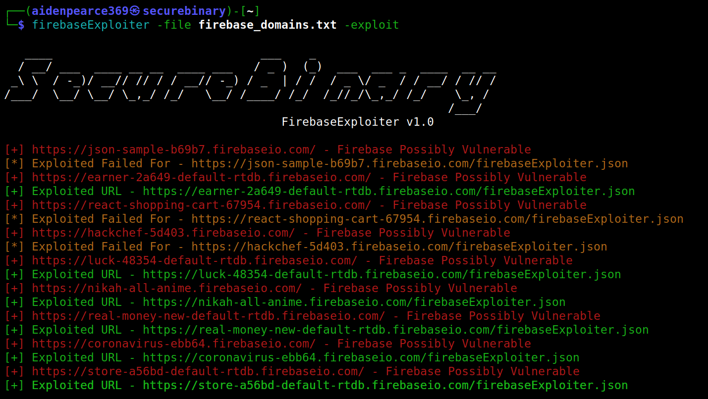
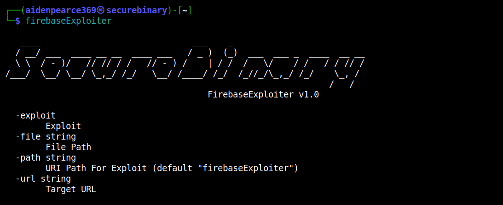
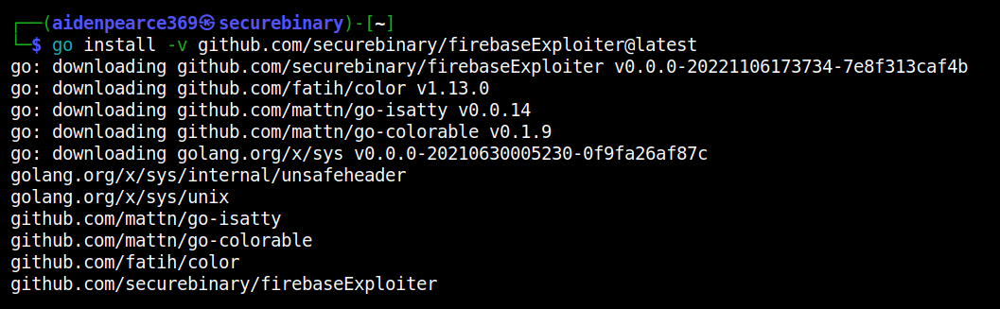
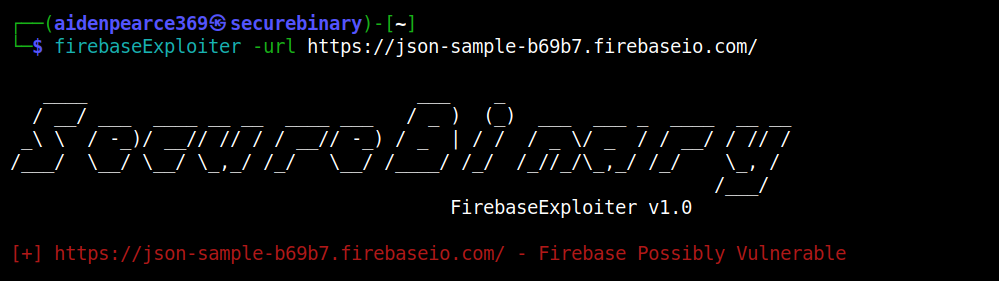
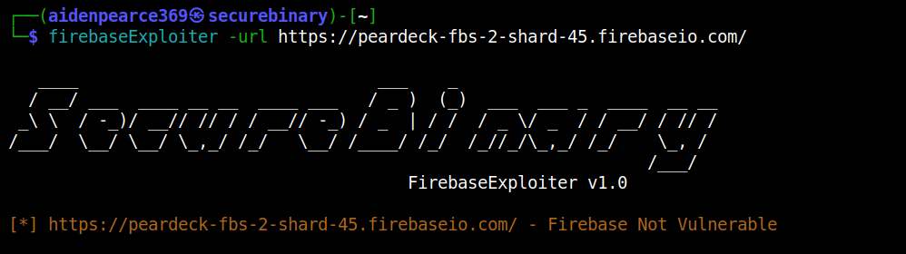
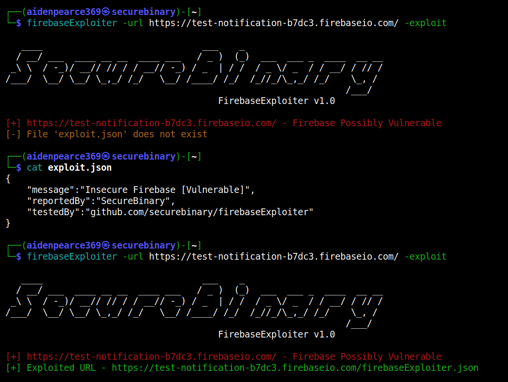
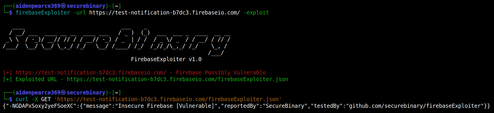
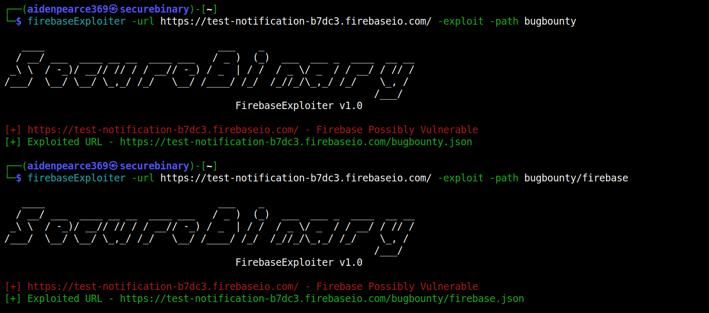
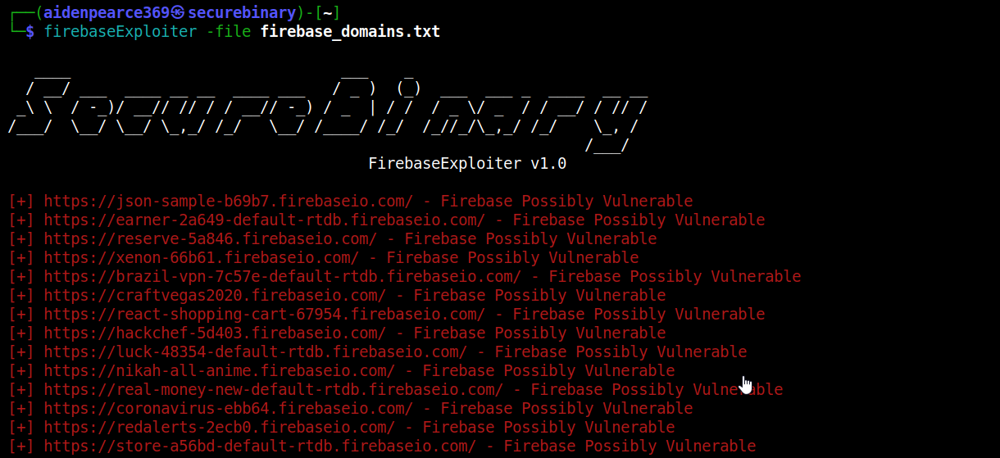

<h4 align="center">Insecure Firebase CLI Scanner & Exploit.</h4>


<p align="center">
<a href="https://github.com/securebinary/firebaseExploiter/"></a>
<a href="https://twitter.com/thesecurebinary"></a>
</p>
      
<p align="center">
  <a href="#features">Features</a> •
  <a href="#installation">Install</a> •
  <a href="#running-firebaseexploiter">Usage</a>
</p>

## Features



 - Mass vulnerability scanning from list of hosts
 - Custom JSON data in `exploit.json` to upload during exploit
 - Custom `URI path` for exploit


## Usage



This will display help for the CLI tool. Here are all the required arguments it supports.


## Installation

FirebaseExploiter was built using go1.19. Make sure you use latest version of [Go](https://go.dev/doc/install) to install successfully. Run the following command to install the latest version:

```bash
go install -v github.com/securebinary/firebaseExploiter@latest
```



## Running FirebaseExploiter

To scan a specific domain to check for Insecure Firebase DB.





To exploit a Firebase DB to write your own JSON document in it.



Create your own `exploit.json` file in proper JSON format to exploit vulnerable Firebase DBs.

Checking the exploited URL to verify the vulnerability.



Adding `custom path` for exploiting Firebase DBs.



Mass scanning for Insecure Firebase Databases from list of target hosts.



Exploiting vulnerable Firebase DBs from the list of target hosts.


## License
`FirebaseExploiter` is made with 🖤 by the `SecureBinary` team. Any tweaks / community contribution are welcome.
